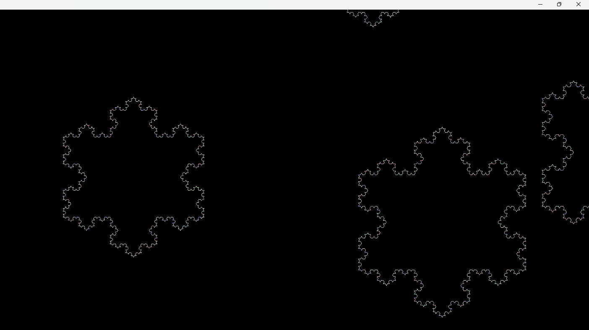

# Snow Koch
Snowfall from Koch snowflakes

# Requirements

1) CMake
2) Freeglut
3) OpenGL

# Installation

1) Clone this source
2) CMake : Configure
3) CMake : Build
4) CMake : Install
5) Run binary from "Snow Koch" folder
